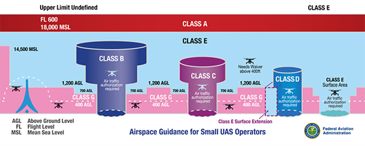

# UAS Operations under part 107 Remote Pilot License
FAA Part 107: Small Unmanned Aircraft Systems

Part 107 is an FAA-certified remote pilot license that allows operators to operate drones for non-recreational purposes, including some funded research purposes.

* For more information: [FAA Commercial Operators](https://www.faa.gov/uas/commercial_operators)
* Required for any drone operation for non-recreational purposes
* Recreational Flight Definition: [FAA Recreational Flyers](https://www.faa.gov/uas/recreational_flyers)

Brief Video Explanation
<iframe width="560" height="315" src="https://www.youtube.com/embed/4-ENlZnInLE?si=2JW5_FB5d36qmIdb" title="YouTube video player" frameborder="0" allow="accelerometer; autoplay; clipboard-write; encrypted-media; gyroscope; picture-in-picture; web-share" allowfullscreen></iframe>

# Overview
The following are a few main categories to familiarize yourself with the operational requirements to fly in United States airspaces especially those near the Purdue University campus, which is located under a class D airport (Purdue University airport). This document only briefly covers a basic overview of the operating procedures. Please refer to the official [FAR/AIM regulation](https://www.ecfr.gov/current/title-14/chapter-I/subchapter-F/part-107) for detailed legal requirements.

All UAS non-recreational UAS operations must be flown under the FAA Part 107 rules. Aircraft must fly in "Class G" airspace at all time unless received additional air traffic authorization.

# Remote Pilot-in-command (PIC)
* Responsible for and is the final authority for all operations
    * Must ensure all UAS operation complies with all application regulations
* PIC is required to be in “direct supervision” of any operators and has the ability to immediately take direct control of the UAS
* All operations must remain in Visual line-of-sight (VLOS)
* VLOS can be done through Visual observer with means of effective communication to PIC
* PIC Restriction
    * No alcohol within 8 hours
    * Cannot have a blood alcohol concentration of 0.04 or greater

# Visual Observer
* Must maintain effective communication with PIC at all times
* Purpose
    * Scan airspace for potential collision hazard
    * Maintain awareness of UAS

# Unmanned Aircraft Systems (UAS)
* Small unmanned aircraft systems (sUAS) are drones weighing less than 55 lbs at all time.
* Generally,
    * No UAS Operations over human (Refer to [FAR/AIM 107.100](https://www.ecfr.gov/current/title-14/section-107.100))
    * No exposed parts that would lacerate human skin upon impact with human
    * No operations over open-air assemblies of human beings

* Drone operating under part 107 outdoors must be registered with the FAA
    * [FAA DroneZone](https://www.faa.gov/uas/getting_started/register_drone)
    * The registration number must be labeled visibly on the vehicle
    * Registration Certificate must be in the pilot’s possession during operation
* The registration number must be written visibly on the UAS

# Operating Condition
* Remain in visual-line-of-sight (VLOS)
* Cannot operate over a congested area
* Crewed aircraft ALWAYS have the right-of-way
* Night Operations
    * UAS must equipped with anti-collision lighting visible at least 3 statute miles
* If operated near airports or congested areas, thoroughly check the allowed airspace and safety requirements

# Flight Operation procedures and requirements
* PIC must perform a preflight inspection to sUAS
* Must ensure the flight will not pose a hazard to others
* Must not operate UAS carelessly
* In-flight emergency
    * PIC can deviate from any rule to accommodate the specific emergency
    * Must report if a deviation occurs

# Reporting Accidents
* Accidents must be reported within 10 calendar days if
    * Serious injury to a person occurs
    * Any loss of consciousness
    * Damage to any property exceeding $500 for cost of repair
    * Damage to any fair market value of property exceeding $500

