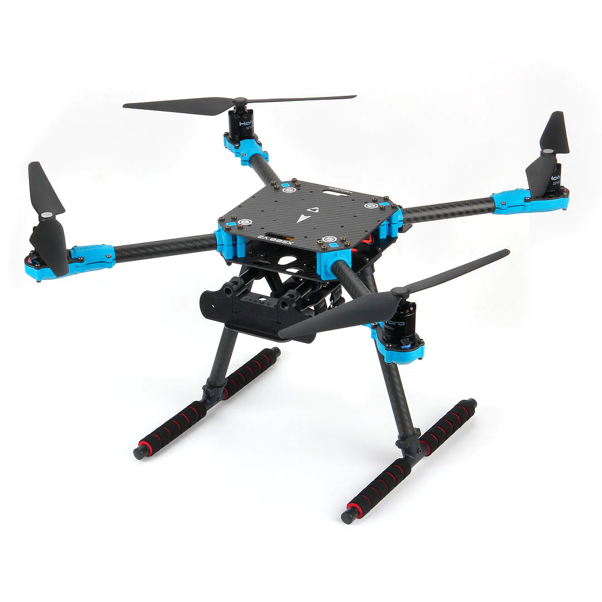

# Holybro X500 Model Custom Build with Raspberry Pi Onboard computer

For the IEEE Drone Maze 2024 competition to be proposed to host at ICRA 2024 in Yokohama, Japan, Purdue University team proposes a custom-improved model for the Holybro X500 model.

We have deviated from the previous year's PX4Vision drone due to the discontinuation of the development kit by Holybro.

# Holybro X500
[Holybro's X500](https://holybro.com/products/x500-v2-kits?_pos=2&_sid=8666a2b5e&_ss=r) quadrotor frame provides sufficient stability along with the capacity to carry neccessary onboard sensors.

Vehicle Specification:

* Wheelbase: 500mm
* Motor mount pattern: 16x16mm
* Frame Body: 144x144mm, 2mm thick
* Landing gear height: 215 mm
* Space between top and bottom plates: 28mm
* Weight: 610g

Note: Battery we plan to use is 4S 4000mAh 30C Lipo Battery

# Pixhawk RPi CM4 Baseboard and On-board Computer
For the Flight Controller board, the [Pixhawk RPi CM4 Baseboard](https://holybro.com/collections/autopilot-flight-controllers/products/pixhawk-rpi-cm4-baseboard) with the Pixhawk 6X FC Module option will be used to allow an onboard flight computer with the [Raspberry Pi Compute Module 4](https://holybro.com/products/raspberry-pi-cm4?variant=42577276174525).

This UAS model will have the onboard computing capability from the Raspberry Pi along with the addition [Google Cloral](https://coral.ai/products/accelerator) to aid the computational power for use in future computations of navigation, Computer Vision, and other computationally inefficient processes.

# 2D Lidar Sensor
For distance and awareness data, a 2D 360 degrees Lidar will be equipped onboard the X500 frame.
