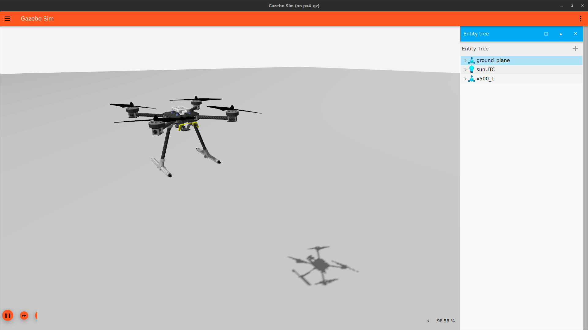

# Simulator

Running Gazebo Garden with PX4 Autopilot via offboard control commands is set up in our sample repository. The simulator is set up using Docker container and implement a ROS2 and Gazebo Garden bridge for the ROS2 communication protocal to allow ROS2 scripts usage.



# Repository

The [PX4 Gazebo Docker Repository](https://github.com/w-sribunma/GZ-PX4-docker) contains a run script for installation of most required dependencies required to run offboard control algorithm for quadrotors. The repository requires an Ubuntu operating system with Gazebo Garden installed. This can be done using respective dual boots with Ubuntu Operating systems. [Dual-boot Ubuntu environment instructions](https://www.xda-developers.com/dual-boot-windows-11-linux/)

Navigate to the respective branch and clone the repository to download and clone the software package.

``` py
git clone https://github.com/w-sribunma/GZ-PX4-docker -b <branch name>
```
<iframe width="560" height="315" src="https://www.youtube.com/embed/xgbNEAuxa1I?si=OqXjr1uHUDgKuz3p" title="YouTube video player" frameborder="0" allow="accelerometer; autoplay; clipboard-write; encrypted-media; gyroscope; picture-in-picture; web-share" allowfullscreen></iframe>

* Note that this demo is recorded on Oct 25, 2023 with the following system 
    * Linux Ubuntu 22.04
    * Memory: 32 GB
    * GPU: NVIDIA Mesa Intel Graphics
        * GPU Driver: Nvidia Driver Version 525

# Dependencies

[ROS2 and Gazebo bridge](https://github.com/gazebosim/ros_gz) should be built from source. Please follow the link to navigate to the respective github repository and install the ros_gz package from source.

In the GZ-PX4-docker directory, navigate to ```./get_src.sh``` and make make necessary adjustments to any linked repository.

# Building the simulator
In the cloned package, build Docker image
```py
docker compose build
```

Accessing the terminal shell for the setup service inside docker container, run the following command in two separate containers to start the container with a shell.
```
./run_dev.sh
```

```py
docker exec -u user -it px4_gz-px4_gz-1 terminator
```

This action to open up a new terminator shell contained inside a docker container. Split the docker into 3 different panels or tabs.

* Terminal 1:
    * Navigate to px4 directory using ```cd px4```
    * Build px4_sitl from the PX4 Autopilot ```make px4_sitl``` when running this container shell for the first time.
    * To start the PX4 Gazebo Garden instance, run the [PX4 autostart](https://docs.px4.io/main/en/sim_gazebo_gz/) command ```PX4_SYS_AUTOSTART=4001 PX4_GZ_MODEL=x500_lidar ./build/px4_sitl_default/bin/px4 -i 1``` to start the gazebo software with the PX4 X500 model with onboard 360 degrees lidar sensor. 
    * Note models can be changed by modifying ```PX4_GZ_MODEL=<model name>```
    * To start PX4_sitl with a different world model, set ```PX4_GZ_WORLD=<world name>``` in the autostart command
 
* Terminal 2:
    * To run a DDS agent for Gazebo PX4 instance communication with ROS2, run ```MicroXRCEAgent udp4 -p 8888```
* Terminal 3:
    * This terminal serves to run any ROS2 packages required for the mission. Navigate to ros2_ws directory ```cd ros2_ws``` and build ROS2 workspace ```colcon build```
    * Source ros2 environment ```source install/setup.bash```
    * From the built repository under px4_offboard package, run the desired offboard script with ```ros2 run px4_offboard [script name]``` to communicate between simulator and ROS2 environment and use offboard control inputs with PX4 Autopilot.
