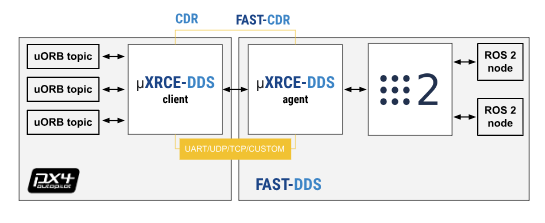

## Working with PX4 with ROS 2

PX4 Autopilot allows full control and communication between ROS2 and PX4 through subscribing and publishing ROS2 nodes to interect with PX4 uORB topics. PX4 [official documentation](https://docs.px4.io/main/en/ros/ros2_comm.html) contains a detailed structure on how the architecture works. This page will provide a brief description on working with PX4 V1.14 release through the new uXRCE-DDS communications middleware and provide additional information regarding acquiring ROS2 topics from Pixhawk flight computer sensors through serial or other protocols.

# uXRCE-DDS middleware
This [uXRCE-DDSs). The image below shows a great representation of how the communication protocal works through uXRCE-DDS, allowing communication between PX4 and ROS2 in its respective companion computer.



## Setup

This section will go through setting up the required dependencies for acquiring communications from Pixhawk to a companion computer. Note that this is tested using PX4 V1.14 and ROS2 Humble on an Ubuntu 22.04 system. PX4 Documentations contain some instructions, but we have narrowed down some instructions that worked during our installation. This will contain some repreated instruction from the official documentation along with some of our minor adjustments as neccesarry.

This require an installation of PX4 Autopilot if you are planning to use a Simulator for this.
# Flight Controller Client Setup
On a flight controller flashed with PX4 v1.14, you can start the uXRCE-DDS client. This runs autonomatically when flight controller port is set to output MAVLINK messages by enabling MAVLINK config on the vehicle parameter lists.

# Companion Computer Agent Setup
On your Linux-based companion computer, you can setup and install Micro XRCE-DDS Agent to allow the communication with PX4 using ROS2 on your computer. This can be done by running the following script on your terminal to build dependencies for the agent from source.

```bash
git clone https://github.com/eProsima/Micro-XRCE-DDS-Agent.git
cd Micro-XRCE-DDS-Agent
mkdir build
cd build
cmake ..
make
sudo make install
sudo ldconfig /usr/local/lib/
```

With those agents set up, you can start an agent on your companion computer to connect with a respective uXRCE-DDS client.

- For those running on a simulator:
```bash
MicroXRCEAgent udp4 -p 8888
```

- For those connected through a serial port through USB (note "ttyUSB*" can vary depending on the amount of USB connections to your computer):
```bash
MicroXRCEAgent serial --dev /dev/ttyUSB0 -b 921600
```

- For those connected through a serial port with Raspberry Pi terminal
```bash
sudo MicroXRCEAgent serial --dev /dev/serial0 -b 921600
```
Once the agent is started for the correct client set-up, you should be able to view ROS2 topics through ```ros2 topic list```

